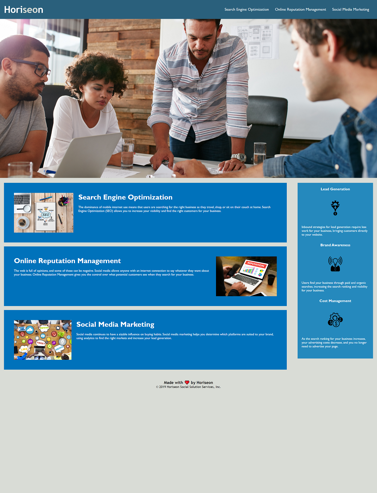

# Meeting Accessibility Standards

## Description

During this project, it was my task to take an already developed website and make it more semantic. This allows the webpage to be more accessible for everyone. Including those who may have a visual impairment, a hearing impairment, or any other disabilility, so everyone have an equal user experience. I have learned the importance of making sure my code is clear and easy to read, as well as gaining the ability to use special attributes such as alt and aria. I have also done my best to consolodate the css so it appears to be simpler to read and more consice.

## Table of Contents

* [License](#license)
* [Contributing](#contributing)
* [Screenshot](#screenshot)
* [Link](#link)
* [Questions](#questions)

## License

MIT

## Contributing

Ianaac27

## Screenshot

Here is the appearence of the updated website.

## Link

Here is the link to the [deployed application](https://ianaac27.github.io/Meeting-Accessibility-Standards/)

## Questions

If you have any questions, please refer to my contact information below.

[GitHub: Ianaac27](https://www.github.com/Ianaac27)

Email: ian.fleshmancooper@gmail.com

